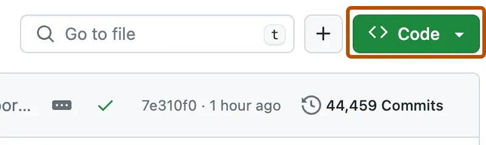
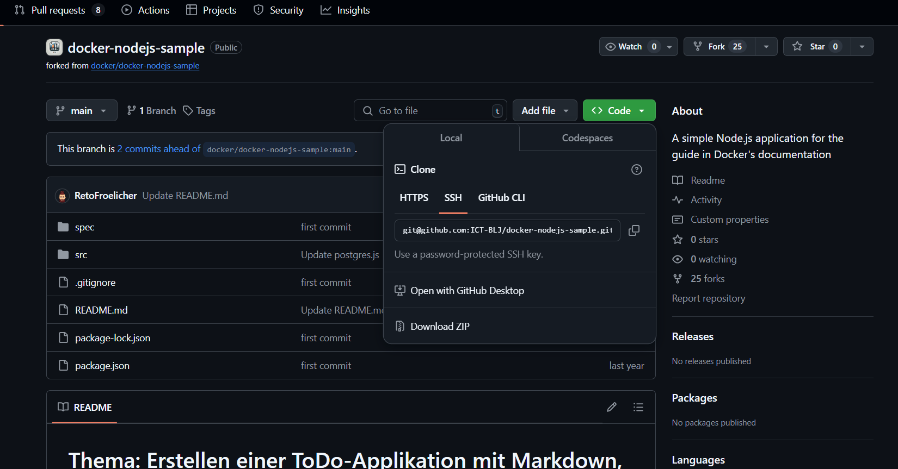
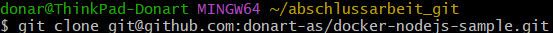
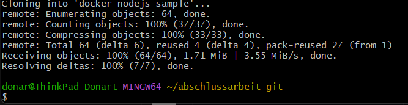
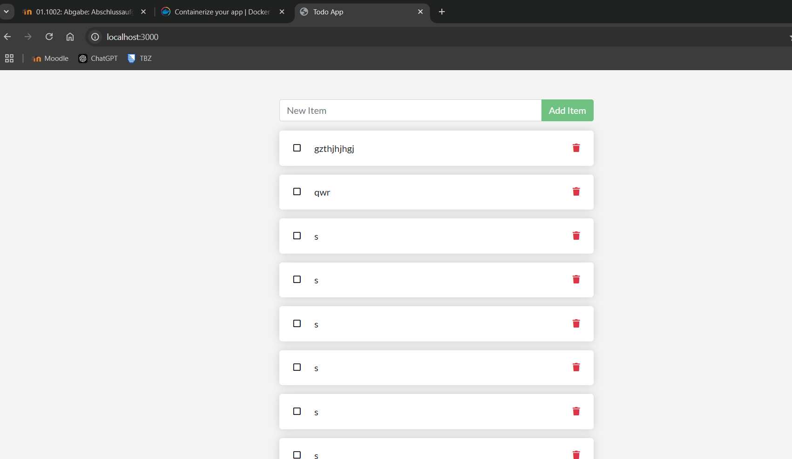

# Installation des Projekts

## repository Clonen

1. Navigieren Sie auf GitHub zur Hauptseite des Repositorys.

2. Klicke oberhalb der Liste der Dateien auf  Code.

3. Kopiere die  SSH URL für das Repository.

4. Öffne Git Bash.

5. Gib git clone ein, und füge dann die zuvor kopierte URL ein.

7. Drücke die EINGABETASTE, um den lokalen Klon zu erstellen.

## Installation der notwendigen Pakete

Bevor man ein paket installiert, sollte man den Anweisungen bei GitHub Packages authentifizieren. Diese Angaben sollte man dafür verwenden:

GITHUB_Token: um Pakete zu veröffentlichen.
read:Packages: Um Pakete aus anderen privaten Repositories zu installieren.

**Wichtig zu beachten:**
Man sollte den Anweisungen gemäss des Paketclient beachten bevor man ein Paket installiert.

## Docker konfiguration und -Installation

1. Laden Sie das Installationsprogramm über die oben angezeigte Download-Schaltfläche oder über die Versionshinweise herunter.

2. Führen Sie einen Doppelklick auf Docker Desktop Installer.exe aus, um das Setup zu starten. Docker Desktop wird standardmässig unter C:\Program Files\Docker\Docker installiert.

3. Befolgen Sie die Hinweise des Setup-Assistenten, um das Programm zu autorisieren und den Installationsprozess fortzusetzen.

4. Ist die Installation erfolgreich, klicken Sie auf „Schliessen“, um den Vorgang abzuschliessen.

5. Beim starten des Docker Desktop melden sie sich mit ihren Konto an oder erstellen sie eines.

## Starten der Applikation in einem Docker-Container

1. Starten sie zuerst den Container. (Solang der Container nicht funktioniert wird die website nicht reigeschaltet.)

2. Geben sie auf Google Chrome **Localhost:3000**, um an der Website zu gelangen.

